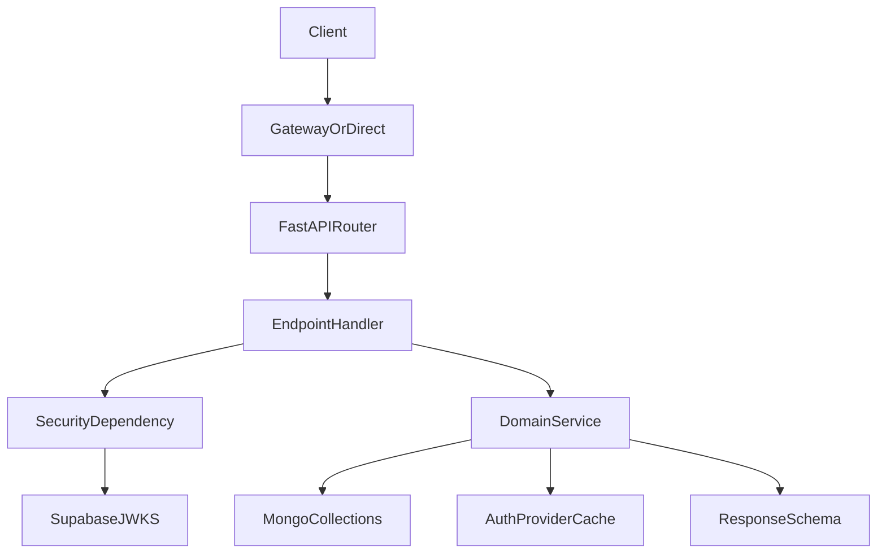

# Chapters Blogs Backend Architecture

## Service role

This service owns blog-domain APIs for posts, comments, replies, likes, and health checks.
It is implemented with FastAPI, uses MongoDB (Motor driver) for persistence, and integrates with Supabase Auth for identity and user profile data.

## Runtime composition

- App bootstrap: `app/main.py`
- Router assembly: `app/api/v1/api.py`
- Endpoint handlers: `app/api/v1/endpoints/blogs.py`
- Domain services: `app/services/blog.py`, `app/services/auth_provider.py`, `app/services/status.py`
- Security dependency: `app/core/security.py`
- DB connection and collections: `app/db/database.py`
- API contracts: `app/schemas/blog.py`, `app/schemas/responses.py`

## Layered design

1. **HTTP layer**: routing, request parsing, dependency injection.
2. **Service layer**: domain logic, ownership checks, orchestration.
3. **Data layer**: direct async collection operations.
4. **Cross-cutting layer**: config, exceptions, auth, status/uptime.

## Mount and route prefixes

- Version prefix from settings: `/api/v1`
- Service prefix from settings: `/blogs`
- Effective root path: `/api/v1/blogs`
- OpenAPI JSON path: `/api/v1/blogs/openapi.json`

## Request flow

## Authentication trust boundary

Protected endpoints resolve identity in `get_current_user_id`:

1. Decode Bearer token via Supabase JWKS.
2. Reject requests without valid Bearer token.

## Data and integration boundaries

- **MongoDB** is the source of truth for blog content and likes.
- **Supabase Auth** is used for:
  - JWT issuer/audience/signature verification via JWKS
  - optional user enrichment from token claims

The service caches user profile claims from validated tokens in-process for read enrichment.

## Failure mode behavior

- If Supabase auth provider health fails but Mongo is healthy, health status is marked as `degraded`.
- If Mongo health fails, health status becomes `unhealthy`.
- Debug endpoints remain in the same router and are gated by environment logic (`is_debug_endpoint_enabled`).

## Notable architectural risks

- Health endpoint status code wiring currently does not propagate non-200 status as intended.
- Blog deletion order can leave orphaned reply records.
- Recursive reply traversal has no explicit depth guard.

See [`CURRENT_ISSUES.md`](CURRENT_ISSUES.md) for prioritized details.
